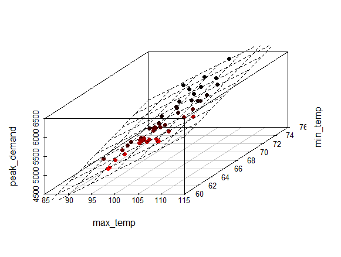
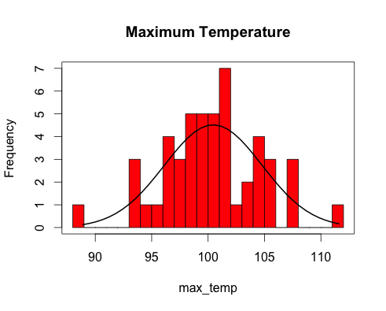
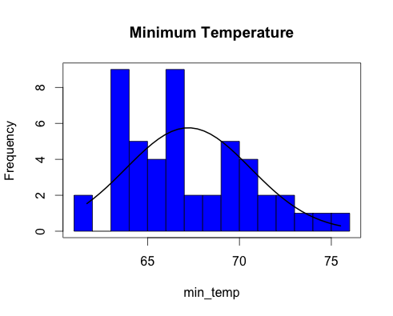
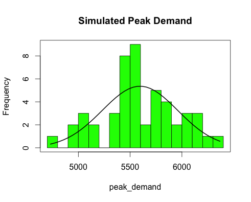

Electricity_Peak_Demand_Analysis
================================

Tools for Peak Demand Analysis written in R

Peak Demand is an important number used in the design of Electric Utility Generation, Transmission and Distribution systems.

My goal is to develop tools in R that help in understanding the nature of Peak Demand based on my twenty year experience in the electric utility industry.   

#####Linear Model

If we use linear regression to model peak demand as a function of maximum and minimum temperatures we obtain the following 3D Scatter Plot. 

#####Histograms

